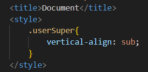
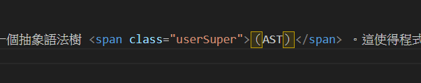
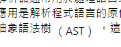

# 第3次作業-作業-HW3
>
>學號：111111211
> 
>姓名：李俊威
> 
>作業撰寫時間：30 (mins，包含程式撰寫時間)
> 
>最後撰寫文件日期：2023/12/24
>

本份文件包含以下主題：(至少需下面兩項，若是有多者可以自行新增)
- [x] 說明內容
- [x] 個人認為完成作業須具備觀念

## 說明程式與內容

在head中寫入style標籤設定下標樣式。
 

 
在body中撰寫內容並依照題目給予特定詞句套用下標。
 

 

## 個人認為完成作業須具備觀念
需具備題目閱讀能力、語法熟練度、打字技巧以及認真上課的精神，方可完成此次作業。本次作業中可學到網頁上下標的運用，在日後加入更多編排技巧肯定能做出更加完善的網頁。